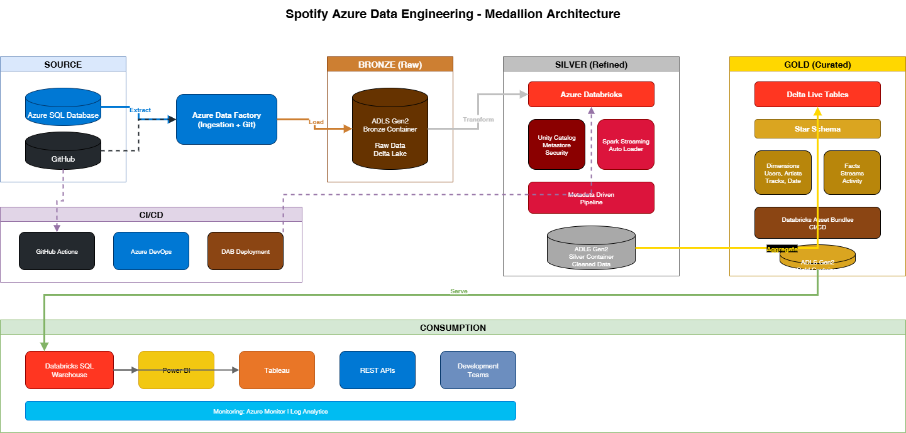
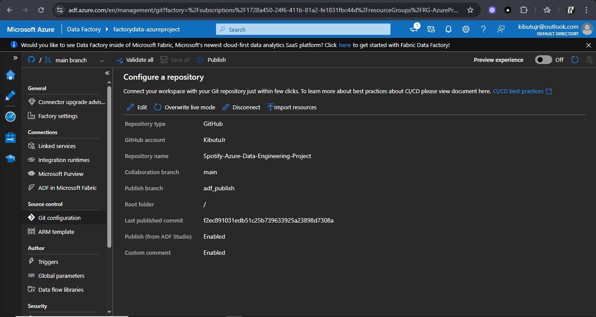
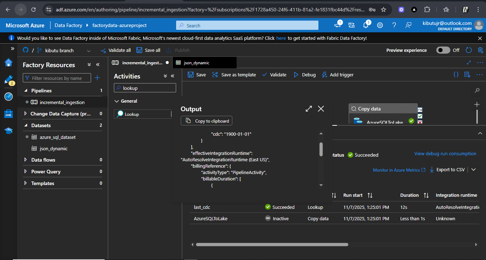
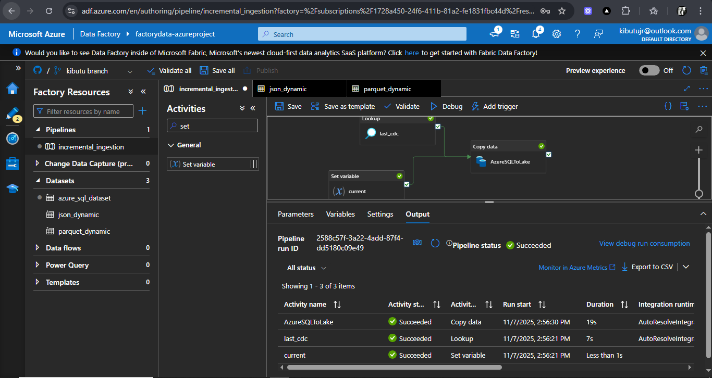
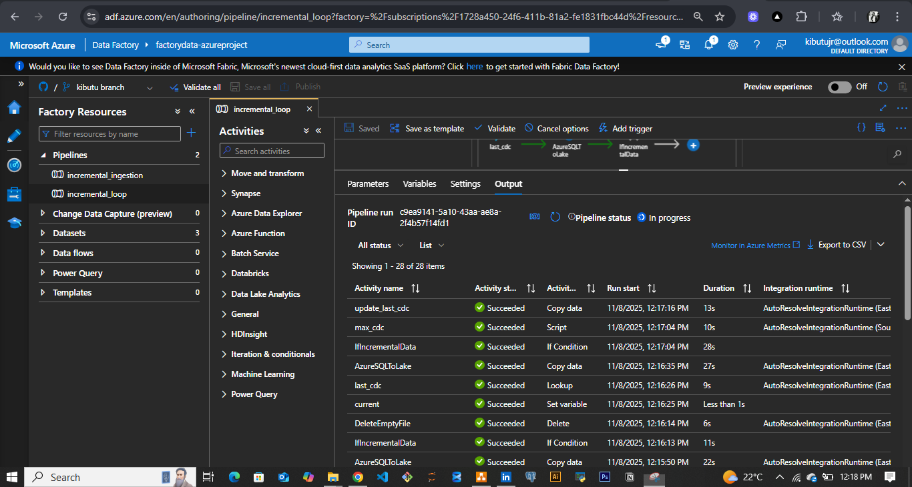
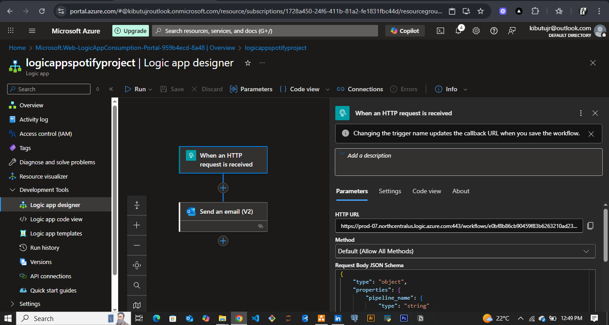
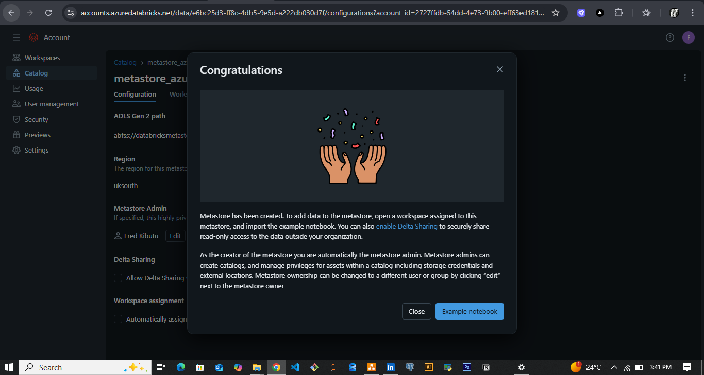
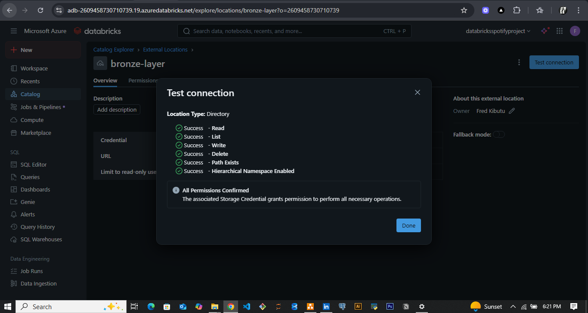

# 🎧 Spotify Azure Data Engineering Project

  
  
  
  
  


---

## 📘 Project Overview

This repository demonstrates a **real-time, enterprise-style data engineering project** built on Azure and Databricks using a simulated Spotify streaming dataset. The objective was to deliver **metadata-driven ingestion**, **incremental and backfill processing**, **stream and batch transformations**, and **analytical visualisations** — enabling actionable insights into user listening behaviour, track popularity and market trends.

---

## 🏗 Architecture & Implementation

### 1. Architecture  
  
The data flows from source → Bronze (raw) → Silver (cleaned, transformed) → Gold (analytics) layers. Azure Data Factory handles ingestion, Azure SQL serves as source storage, Azure Databricks carries out transformations, and Unity Catalog, Delta Lake, and CI/CD practices ensure governance, versioning and production readiness.

### 2. Git & Version Control  
  
The project structure is fully integrated with GitHub, using branching (`dev`, `main`, `feature/...`). Infrastructure pipelines, notebooks and Databricks asset bundles are all versioned and deployed via GitHub Actions.

### 3. Source Tables & Linked Services  
  
Azure SQL Database contains fact & dimension tables. Azure Data Factory uses Linked Services and parameterised datasets to connect to these sources and the data lake.

### 4. Lookup & CDC File Handling  
  
The pipeline uses a JSON `cdc.json` file in Azure Data Lake to track last read timestamps. A Lookup activity reads it dynamically to determine incremental load criteria.

### 5. Ingestion & Copy  
  
Incremental loads and backfill logic are executed via Azure Data Factory pipelines. Custom utilities handle branching, timestamp dynamic SQL and JSON updates.

### 6. Metadata-Driven Pipeline & Looping  
  
Pipeline loops through parameterised tables, with branching logic for new data, historical backfills and CDC folder management.

### 7. Monitoring & Alerts  
  
A Logic App triggers emails and alerts through web activity when pipelines fail — providing robust operational monitoring.

### 8. Unity Catalog & Layers  
  
  
The project uses Unity Catalog metastore, and external storage containers for each layer (Bronze, Silver, Gold) ensuring proper segregation and governance.

---

## 📊 Analytics & Visualizations

### 1. Top Tracks by Listener Engagement

```python
track_engagement = df.join(spark.table("spotify_catalog.`silver-layer`.dimtrack"), on="track_id") \
    .groupBy("track_name") \
    .agg(F.sum("engagement_score").alias("total_engagement")) \
    .orderBy(F.desc("total_engagement"))

display(track_engagement.limit(10))
````

**Visual:**


**Insight:**
Highlights which tracks receive the **highest listener engagement**, indicating which songs are most captivating to users.

---

### 2. Top Artists by Total Streams

```python
artist_streams = df.join(spark.table("spotify_catalog.`silver-layer`.dimartist"), on="artist_id") \
    .groupBy("artist_name") \
    .agg(F.sum("stream_count").alias("total_streams")) \
    .orderBy(F.desc("total_streams"))

display(artist_streams.limit(10))
```

**Visual:**


**Insight:**
Identifies **top-performing artists** by total stream volume — valuable for artist performance benchmarking and promotional strategy.

---

### 3. Top Countries by Listening Time

```python
country_listening = spark.table("spotify_catalog.`silver-layer`.factstream") \
    .join(spark.table("spotify_catalog.`silver-layer`.dimuser"), on="user_id") \
    .groupBy("country") \
    .agg(F.sum("listen_duration").alias("total_listen_duration")) \
    .orderBy(F.desc("total_listen_duration"))

display(country_listening.limit(10))
```

**Visual:**


**Insight:**
Reveals which **locations produce the highest listener activity**, supporting marketing and regional strategy decisions.

---

## 🔧 Key Outcomes & Learnings

* **Incremental ingestion** reduced processing workloads by ~80% for repeated loads.
* **Backfill capability** allowed flexible historical data reprocessing.
* **Stream processing** with Auto Loader and Structured Streaming enabled near real-time ingestion.
* **SCD Type 2 modelling** supported historical dimension tracking for audit and trend analysis.
* **CI/CD practices** using GitHub, branching, and asset bundles brought production readiness.
* **Unified data governance** via Unity Catalog ensured secure, layered access to analytics outputs.

---

## 🚀 Getting Started

1. **Clone this repository** to your local environment:

   ```bash
   git clone https://github.com/<your-username>/spotify-azure-data-engineering.git
   ```

2. **Open** the `databricks.yml` file and configure your:

   * Workspace host
   * Root path
   * Environment variables

3. **Deploy to your development environment:**

   ```bash
   databricks bundle validate
   databricks bundle deploy dev
   ```

4. **Load notebooks** under `/notebooks/`, attach them to a running cluster, and execute the analytics cells.

5. *(Optional)* **Explore Power BI integration** by connecting directly to the Databricks gold layer for business dashboards.

---

## 👨‍💻 Author

**Fred Kibutu**  
*Data Analyst | Data Engineer | Software Engineer*  
📧 [kibutujr@gmail.com](mailto:kibutujr@gmail.com)  
🔗 [LinkedIn](https://www.linkedin.com/in/fred-kibutu)  
🌐 [Portfolio](https://kibutujr.vercel.app)

---

